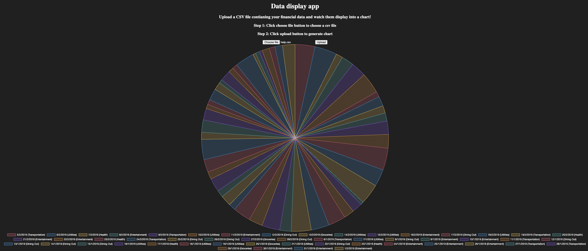

# Introduction to the app
This is a web application where users can upload a CSV file with financial data, and the application will display pie charts based on the uploaded data.\

Tech Stack used: React (Frontend), Flask (Backend)

# Instructions
Clone the app to your local computer.
Follow the README file to run both the backend and front end individually in your terminal.
Open localhost:3000 in your browser once done.
Define a simple, consistent structure for the CSV file(e.g., columns for date, category, amount) or use the uploaded help.csv file template in the app and watch the app converts the data into a pie chart.

